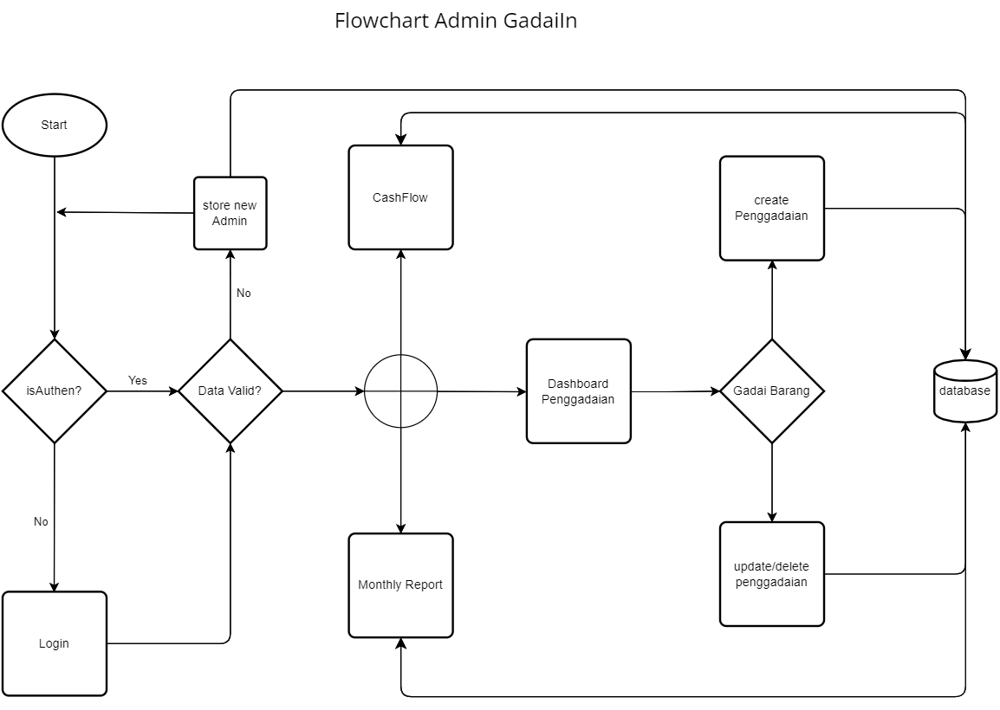
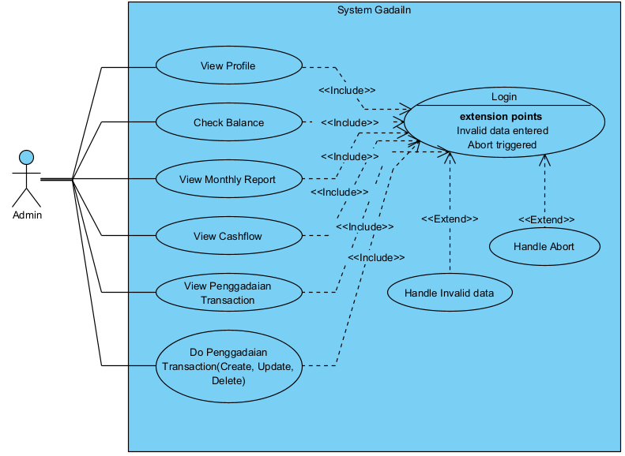

# GadaiIn

## Table of Contents

- [Project Overview](#project-overview)
- [Features](#features)
- [flowchart](#Flowchart)
- [Use-case](#Use-Case)

## Project Overview

Aplikasi yang digunakan untuk mencatat penggadaian barang oleh pelaku usaha penggadaian serta memiliki cashflow uang dari setiap barang yang digadai sesuai dengan jatuh tempo waktu yang diambil.

## Features

-login admin (auth)
-Balance uang kas untuk penggadaian
-cashflow uang setiap aktivitas penggadaian
-add penggadaian barang(barang, NIK penggadai, nama penggadai,jumlah harga gadai barang, jatuh tempo, persenan bunga(sesuai jatuh tempo yang diambil),  )
-laporan bulanan penggadaian
-status penggadaian

## Flowchart

## Use Case

